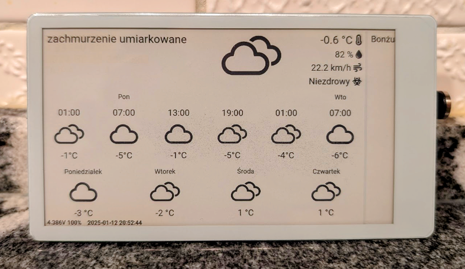

# web2png

`Web2PNG` is a lightweight web server that captures and serves web pages as PNG images, enabling easy integration with
devices or systems that require static image representations of dynamic web content.

## Background

I have a few EspHome devices that display weather, home status, temperatures, etc. While I enjoy using EspHome, I find
creating graphical interfaces with C/YAML/LVGL tedious and overly complex, especially for read-only panels. Instead, I
prefer designing a clean and aesthetically pleasing interface using HTML/CSS/JS elsewhere and then simply loading it
onto the devices.

[HABPanel](https://www.openhab.org/docs/ui/habpanel/habpanel.html#the-main-menu) fits perfectly for this purpose.

This script renders complicated webpages with JavaScript into plain PNG files that can easily be transferred to dummy
EspHome devices. The resulting output might look something like this:



## Usage of web2png

### Installation

To install `web2png`, use the following npm command:

```bash
npm i -g web2png
```

This will install `web2png` globally on your system, making it available as a CLI command.

### Usage and Command-Line Parameters

Once installed, you can use the `web2png` command to generate PNG images from web pages.

The most basic usage is:

```bash
web2png
```
or
```bash
web2png -c <config-file> -p <port>
```

- **`-c`**: Specify a custom configuration file (default is `device-mappings.yml`).
- **`-p`**: Set a custom port (default is `3001`).

Example:

```bash
web2png -c custom-config.yml -p 8080
```

Refer to the [Sample Configuration](#sample-configuration) chapter for details on configuring your `device-mappings.yml`
file. This file allows you to define settings such as resolution, delay, grayscale, and URL mappings for different
devices.

### Running as a Daemon with PM2

To run `web2png` as a background service, you can use the PM2 process manager. Follow these steps:

1. Start the application with PM2:

   ```bash
   pm2 start web2png --name web2png --interpreter none
   ```

2. Save the PM2 process list to ensure it restarts after a system reboot:

   ```bash
   pm2 save
   ```

3. Configure PM2 to start on startup:

   ```bash
   pm2 startup
   ```

This setup allows the `web2png` application to run continuously in the background and restart automatically after
reboots.

## Sample Configuration

To get started, create some panels in HABPanel (for example, dashboards for weather, home status, etc.). Once your
panels are ready, create a `device-mappings.yml` file to define settings like resolution, delay, grayscale, and the URLs
for your devices. Here's an example of what your configuration file might look like:

```yaml
default:
  resolution: '1280x720'    # Default resolution for all devices
  delay: 1000               # Delay in milliseconds to allow content to fully load
  grayscale: false          # Render in color by default
  negate: false             # Do not invert colors
devices:
  device_1:
    url: 'https://example.com'  # Replace with your desired webpage URL
    resolution: '1920x1080'     # Device-specific resolution override
    delay: 2000                 # Additional delay for complex pages
    grayscale: true             # Grayscale rendering enabled for this device
  device_2:
    url: 'https://example2.com' # URL for another device
```

After setting up the `device-mappings.yml` file, run the application using the `web2png` command. Test if the
configuration works by opening the URL http://localhost:3001/screenshot?device=device_1 in your browser. You should
see the rendered PNG for the specified device as per your configuration.


## Sample Usage in ESPHome

```yaml
online_image:
  - url: "http://localhost:3001/screenshot?device=device_1"
    format: png
    id: my_online_image
    update_interval: never
    type: grayscale
    on_error:
      then:
        - logger.log: error downloading!
    on_download_finished:
      then:
        - logger.log: image downloaded
        - component.update: eink_display
        - deep_sleep.enter
  display:
    - platform: t547
      id: eink_display
      update_interval: never
      lambda: |-
        it.image(0, 0, id(my_online_image), COLOR_OFF, COLOR_ON);
```

This YAML snippet demonstrates how to use the `web2png` output in ESPHome to handle and display the rendered PNG images
from your server. The configuration sets up an image component that fetches a rendered PNG from a specified URL and an
e-ink display to render that image. It also includes error handling and triggers actions on download completion, such as
rendering the image and putting the device into deep sleep.
